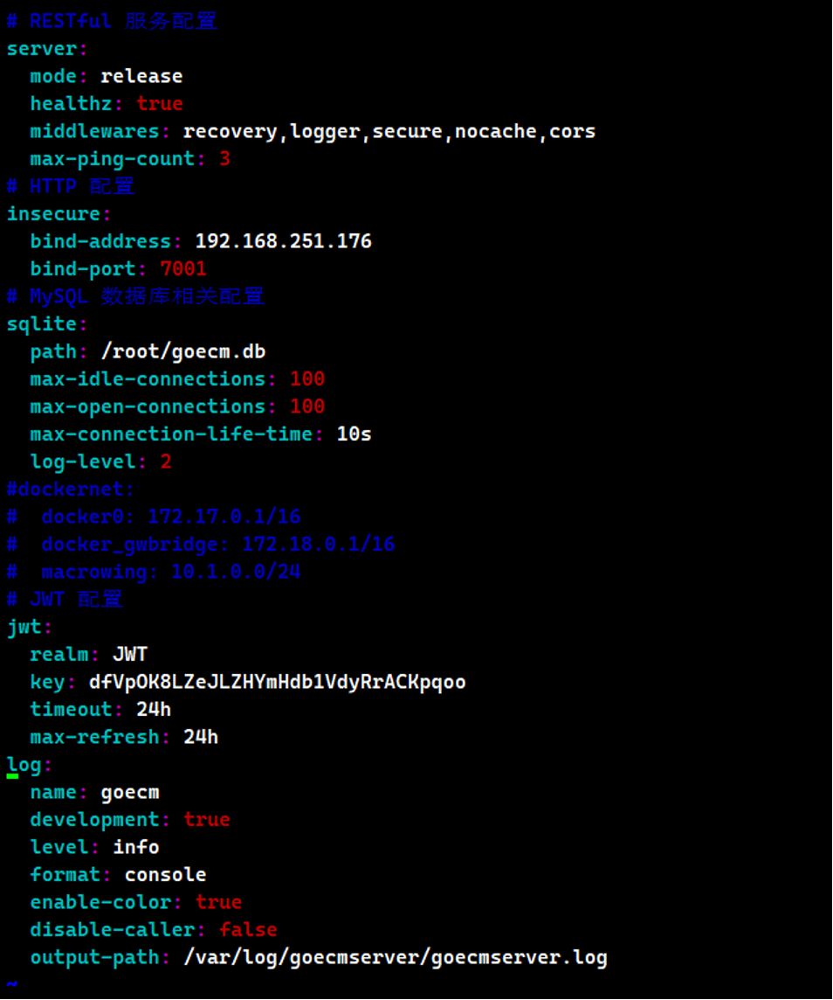
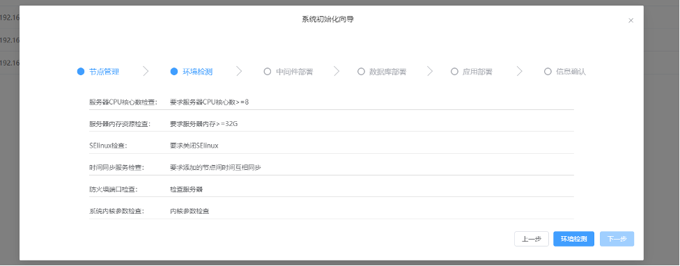

<font color="red">项目仅做演示使用,已脱敏处理</font>

## 部署说明
ECM安装平台是一个协助部署ECM主区域的工具，需要先下载并解压ECM安装包
目前只支持CentOS7.8+  x86系统，swarm环境下部署

## 安装goecmserver
### 下载、解压ECM安装包
执行以下命令下载安装包，或手动上传至服务器
```
cd /home
curl -O x
```

执行以下命令解压ECM安装包(解压非常耗时，请耐心等待)
```
tar xfv x.tar.xz
```

### 下载安装goecmserver
1.	执行以下命令服务端rpm包，或手动上传至服务器
```
curl -O x
```

2.	安装goecmserver服务端
```
rpm -ivh  x
```
3.	编辑服务端配置文件
vi  /etc/goecmserver/config.yaml


配置项说明:
server.mode: 是否是生产环境
server.healthz: 是否在启动之后自检
server.middleware: 当前开启的中间件插件
server.max-ping-count: 自检最大重试次数

insecure.bind-address: http协议监听的ip地址
insecure.bind-port: http协议监听的端口

sqlite.path: 数据库存放位置
sqlite.max-idle-connections: 最大空闲连接数
sqlite.max-open-connections: 最大打开的连接数
sqlite.max-connection-life-time: 空闲链接最大存活时间
log-level: gorm日志级别

dockernet.docker0: 配置docker0网桥的ip地址
dockernet.docker_gwbridge: 配置docker_gwbridge网桥的ip地址
dockernet.macrowing: 配置macrowing网络的地址池

### 启动goecmserver
```
systemctl start goecmserver
```

在goecmserver启动时，如果本机没有安装docker，则会自动安装docker，并初始化swarm，所以dockernet相关配置项如果要自定义，一定要在启动之前定义好
## 安装goecmagent

在需要安装ECM节点的服务器上执行

1. 下载goecmagent包
   `curl -O x`

2. 安装goecmagent
   `rpm -ivh x`

3. 编辑配置文件
   vi /etc/goecmagent/agent-config.yaml
   修改server-addr配置项为goecmserver的ip和端口

   

修改bind-address和bind-port为agent监听的地址和端口


4.	启动goecmagent
`systemctl start goecmagent`

在goecmagent启动时 如果本机没有安装docker，则自动安装docker，配置与goecmserver同步，并以worker的身份加入到swarm中
## 部署ECM

1. 登录页
   浏览器访问goecmserver地址+端口，进入到登录页面
   默认登录用户名密码为 admin edoc2

   

2. 节点管理
   进入到首页的节点管理后确保所有待安装ECM的节点都已经展示出来后点击初始化系统

   

3. 初始化系统
   选择节点角色用于后续表单中自动填充节点ip地址
   其中应用节点是指ECM主服务，如edoc2、transport等等
   中间件节点是指Mysql，redis，rabbitmq，es等服务
   选择完毕后点击下一步

   

4. 环境检测
   点击环境检测，全都通过后点击下一步

   

   

5. 中间件部署

   

（1）	中间件部署模式，选择单机部署或者集群部署，集群部署请确保每个中间件节点都有三个
（2）	中间件配置卡片，每个中间件的配置都是独立的
（3）	当前中间件的节点IP地址，多个ip地址用逗号分割
（4）	当前中间件的存储路径
（5）	单机模式下的ES节点需要填写备份路径

6. 数据库部署


(1)	数据库部署模式，选择内置容器模式或者使用客户提供的数据库
(2)	内置容器部署模式下的数据库节点的IP地址，多个节点用逗号分隔
(3)	内置容器的数据库存储路径
(4)	内置容器的数据库备份路径
(5)	外置数据库部署模式下的数据库节点ip地址
(6)	外置数据库链接账号
(7)	外置数据库链接密码
(8)	外置数据库链接端口
(9)	数据库类型,MySQL或者MSSQL，mysql版本要求8.0.17,mssql版本要求2017+

7. 应用部署

   

   

（1）	选择存储类型，支持选择 本地存储、华为对象存储(OBS)、阿里云对象存储(OSS)、腾讯对象存储(COS)、Ceph存储、兼容性S3存储，不选择默认为本地存储
（2）	存储路径，选择本地存储时实体文件的存储路径
（3）	访问方式，选择http或者https
（4）	访问端口
（5）	docker0网络地址池 不能与物理网络冲突
（6）	gwbridge网络地址池 不能与物理网络冲突
（7）	macrowing网络地址池 不能与物理网络冲突
（8）	对象存储的链接地址，多个地址用逗号分隔
（9）	对象存储的存储桶
（10）	登录ID: accesskey
（11）	登录秘钥: secretkey
（12）	当存储为ceph存储时要配置存储健康检查地址

8. 信息确认

确认配置没问题后点击完成，后端即可开始部署


